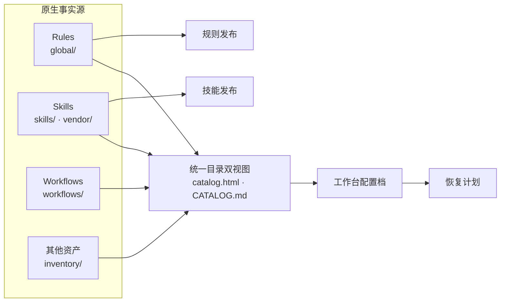

# HarnessOS

HarnessOS 是个人 AI 工作台的轻量受管资产中枢：统一索引用户希望长期保留、复用、迁移、恢复或明确排除的内容，并保留各类资产最合适的原生事实源。

首批资产类型包括规则、技能、工作流、软件与开发工具；未来可继续扩展硬件、服务、数据、模板、字体、模型等非软件类型。仓库只保存可审核的索引与恢复配方，不保存安装包、完整配置、账号、许可证、密钥或机器绝对路径。资产仅在用户明确要求登记、纳管或更新时写入，不主动扫描工作站或从普通对话推断个人偏好。

## 受管内容

- `global/`：跨项目协作规则的事实源。
- `skills/`：HarnessOS 自有 Skills 的事实源。
- `vendor/`：第三方 Skills 的原样副本；来源、许可证与迁移条件见 `vendor/SOURCES.md`。
- `workflows/`：组合人、Agent、Skills 与其他资产的流程卡。
- `inventory/`：资产分类、结构化资产记录与工作台配置档。
- [`catalog.html`](catalog.html)：由上述事实源生成的资产快速浏览入口，支持搜索、筛选和详情查看。
- [`CATALOG.md`](CATALOG.md)：同源生成的精简文本索引，便于 Git 审阅与命令行检索。

Windows 本地日常查看可直接双击 `catalog.html`，或在仓库目录运行 `Start-Process .\catalog.html`。

维护命令和边界见 [AGENTS.md](AGENTS.md)。

## 架构概览

查看完整的交互版：[HarnessOS 受管资产架构图](architecture.html)。
