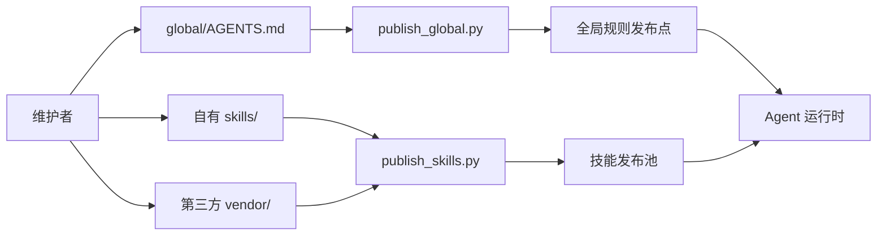

# HarnessOS

HarnessOS 是全局 `AGENTS.md` 与可复用 skills 的单一真相源。

## 受管资产

- `global/AGENTS.md`：发布到各 Agent 的全局协作规则。
- `skills/`：HarnessOS 自有 skills。
- `vendor/`：第三方 skills 的原样副本；来源、许可证与迁移条件见 `vendor/SOURCES.md`。

发布与漂移检查的入口见 [AGENTS.md](AGENTS.md)。

## 架构概览

查看完整的交互版：[HarnessOS 受管资产架构图](architecture.html)。
